# PINJAM FT - Aplikasi Peminjaman Ruangan Fakultas Teknik UNSOED

<p align="center">
  
</p>

Aplikasi web modern untuk mengelola peminjaman ruangan di Fakultas Teknik Universitas Jenderal Soedirman (UNSOED) dengan sistem approval bertingkat dan notifikasi email otomatis.

---

## 📋 Daftar Isi

- [Fitur Utama](#-fitur-utama)
- [Teknologi](#-teknologi)
- [Screenshots](#-screenshots)
- [Instalasi & Setup](#-instalasi--setup)
- [Struktur Database](#-struktur-database)
- [Alur Approval](#-alur-approval)
- [Email Notifications](#-email-notifications)
- [Default Users](#-default-users)
- [License](#-license)

---

## ✨ Fitur Utama

### 🎯 Role-Based Access Control
- **Applicant (APP)**: Mengajukan peminjaman ruangan
- **Sub Coordinator (SCO)**: Review dan approval tahap pertama
- **Wakil Dekan 2 (WD)**: Approval final untuk Aula

### 🚀 Fitur Aplikasi

#### Untuk Applicant
- ✅ **Beranda**: Dashboard dengan statistik & tabel peminjaman (Tab view: Table/Calendar)
- ✅ **Peminjaman**: Form pengajuan dengan upload surat (PDF/Word, max 5MB)
- ✅ **Riwayat**: History lengkap semua pengajuan dengan filter status
- ✅ **Google OAuth**: Login tanpa registrasi menggunakan akun Google @mhs.unsoed.ac.id
- ✅ **Conflict Detection**: Visual warning untuk reservasi yang bentrok

#### Untuk SCO
- ✅ **Dashboard**: Lihat semua pending requests dengan conflict detection
- ✅ **Approval**: Approve/Forward/Reject dengan catatan
- ✅ **Kalender**: Visualisasi jadwal peminjaman
- ✅ **Email Notification**: Notifikasi otomatis saat ada pengajuan baru

#### Untuk WD
- ✅ **Dashboard**: Review khusus pengajuan Aula dari SCO
- ✅ **Final Approval**: Approve/Reject dengan catatan
- ✅ **Email Notification**: Notifikasi saat SCO forward pengajuan

### 🔔 Email Notifications (Otomatis)
1. **Applicant Submit** → Email ke semua SCO
2. **SCO Forward Aula** → Email ke semua WD
3. **SCO/WD Approve/Reject** → Email ke Applicant

### ⚠️ Conflict Detection
- Deteksi otomatis reservasi yang bentrok (ruangan sama, waktu beririsan)
- Visual highlight dengan badge amber & ikon warning
- Counter jumlah konflik per request

---

## 🛠 Teknologi

### Backend
- **Laravel 12** - PHP Framework
- **Inertia.js** - Modern monolith architecture
- **Laravel Fortify** - Authentication scaffolding
- **Laravel Socialite** - Google OAuth integration
- **Laravel Notifications** - Email notification system dengan queue
- **MySQL** - Database

### Frontend
- **React 18** - UI Library
- **TypeScript** - Type-safe JavaScript
- **TailwindCSS** - Utility-first CSS framework
- **shadcn/ui** - High-quality component library
- **Radix UI** - Accessible component primitives
- **date-fns** - Modern date utility
- **react-day-picker** - Flexible calendar component
- **react-hook-form** - Performant form validation
- **Lucide React** - Beautiful icon library

---

## 📸 Screenshots

### Welcome & Authentication

#### Landing Page
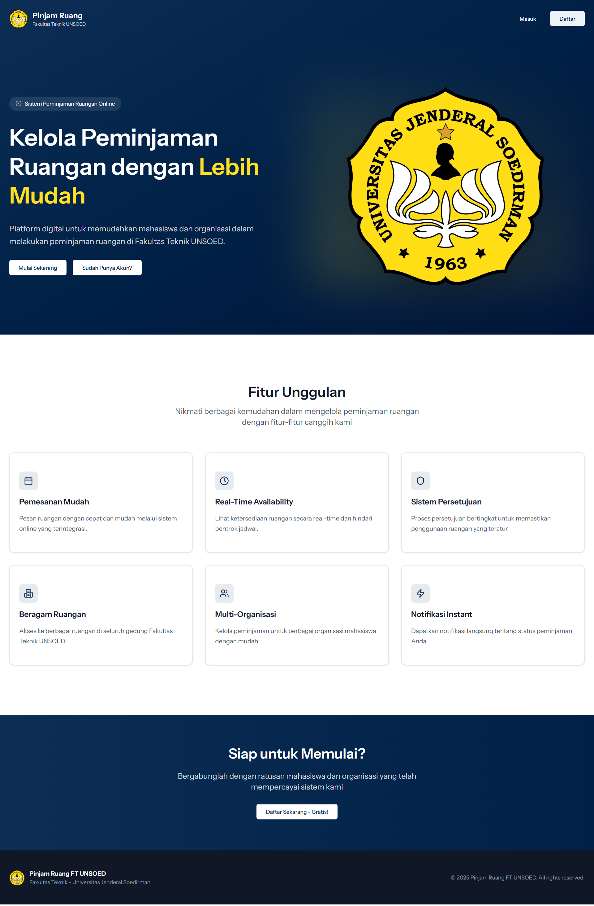
*Halaman welcome dengan quick access untuk login/register*

#### Login Page
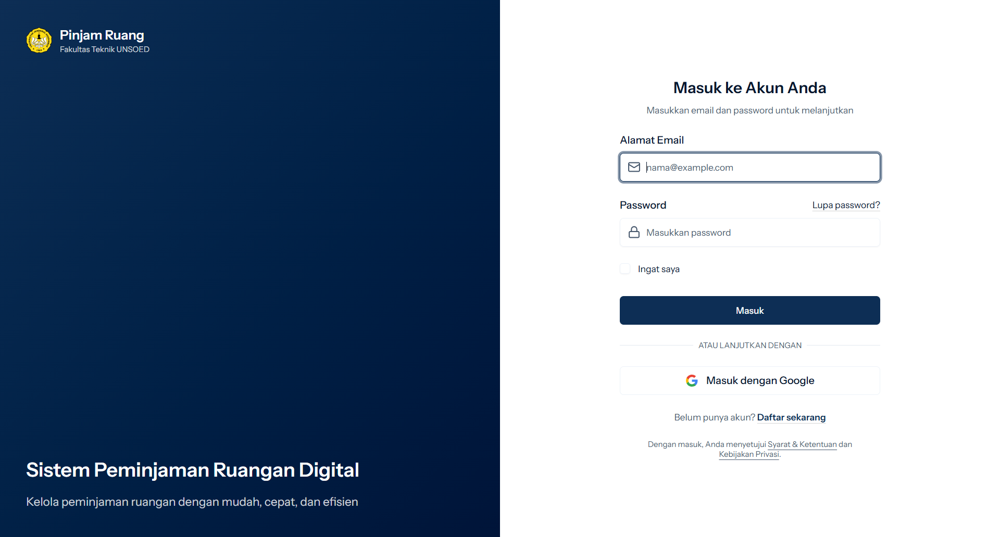
*Login dengan email/password atau Google OAuth (@mhs.unsoed.ac.id)*

#### Register Page
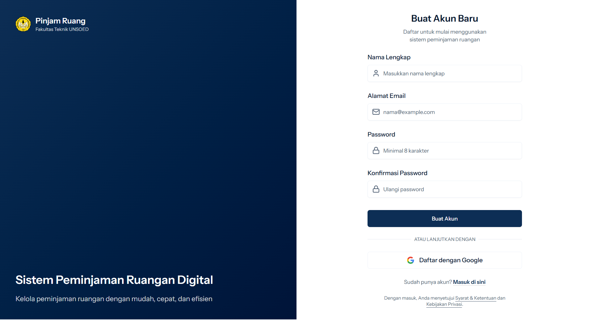
*Registrasi akun baru dengan Google OAuth support*

---

### Applicant Dashboard

#### Beranda - Table View

*Dashboard applicant dengan statistik dan tabel peminjaman*

#### Beranda - Calendar View
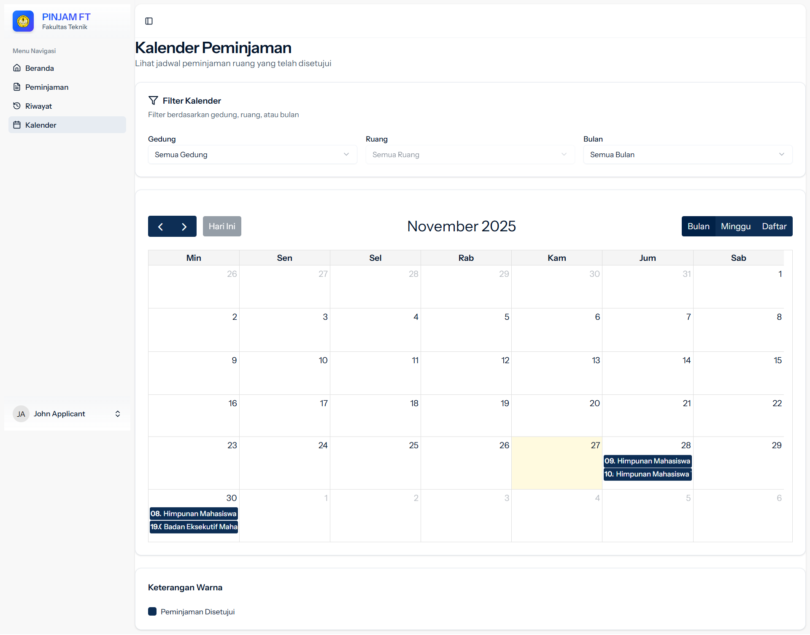
*Visualisasi jadwal peminjaman dalam bentuk kalender*

#### Form Peminjaman
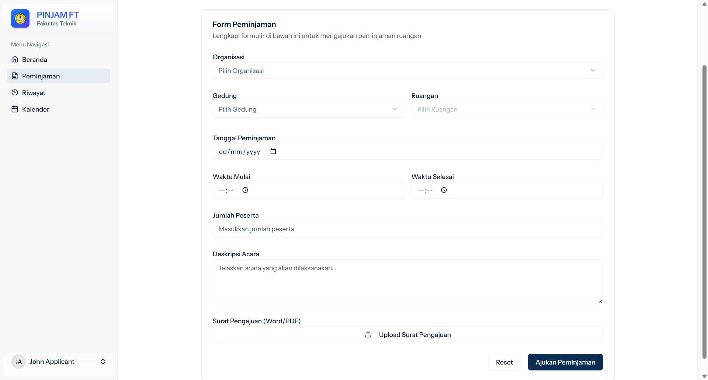
*Form pengajuan peminjaman dengan upload surat (PDF/Word)*

#### Detail Peminjaman
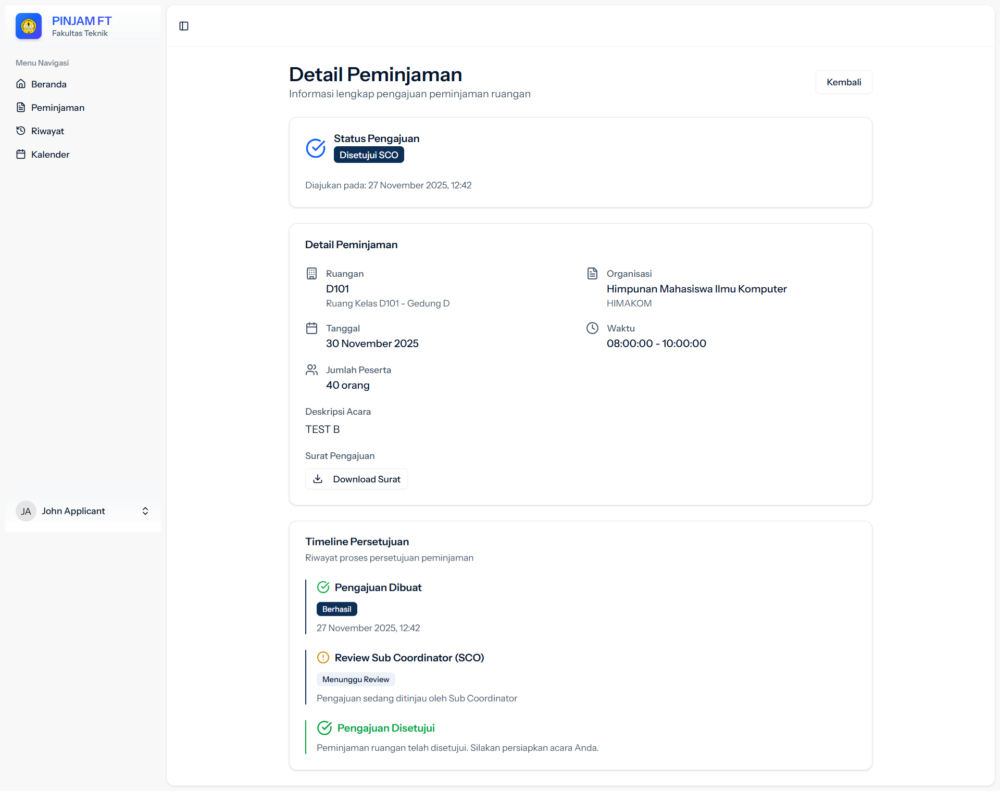
*Detail lengkap status pengajuan dengan tracking approval*

#### Riwayat Peminjaman
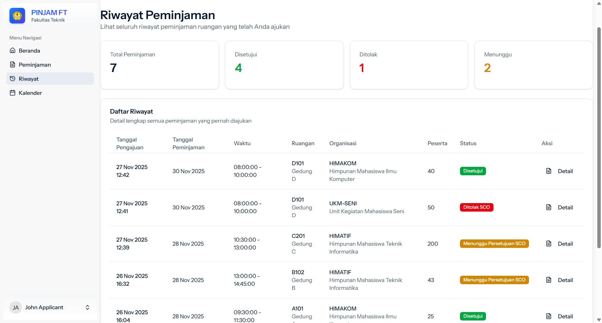
*History semua pengajuan dengan statistik & filter status*

---

### SCO Dashboard

#### Beranda SCO
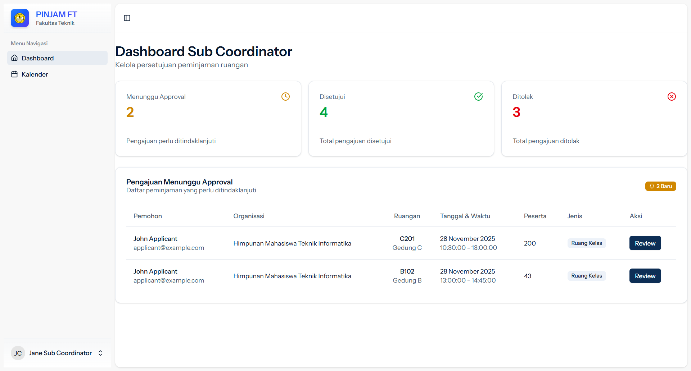
*Dashboard SCO dengan pending requests & conflict detection (amber highlight)*

#### Kalender SCO

*Overview jadwal peminjaman semua ruangan*

#### Approval Page
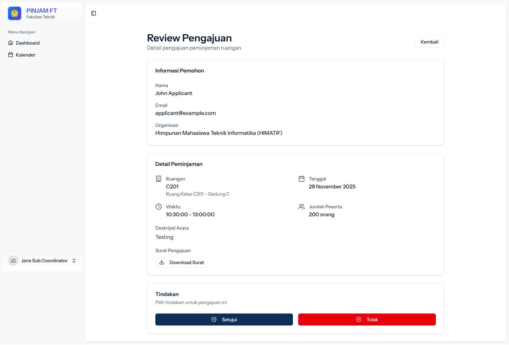
*Halaman review dengan opsi Approve/Forward/Reject + catatan*

---

### WD Dashboard

#### Beranda WD
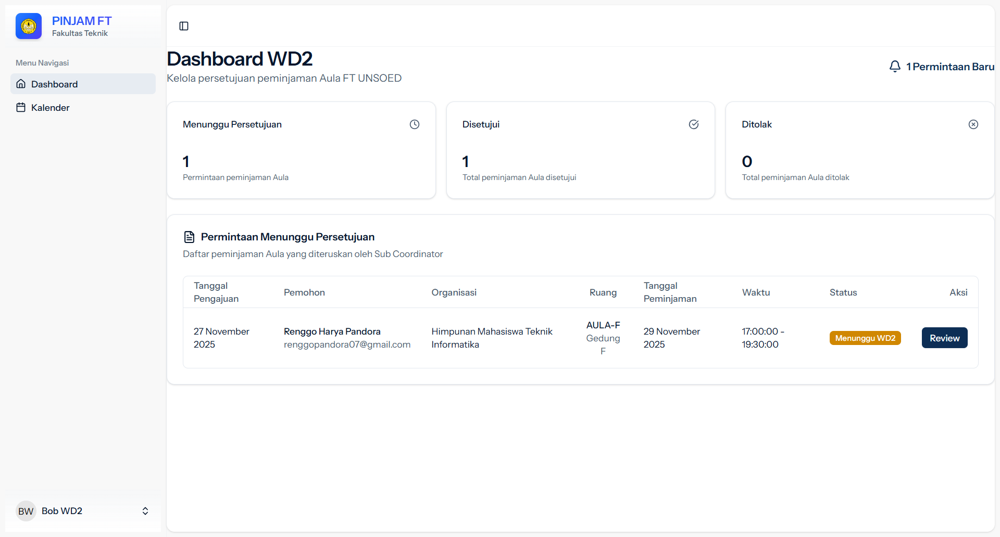
*Dashboard WD untuk approval final Aula*

#### Kalender WD
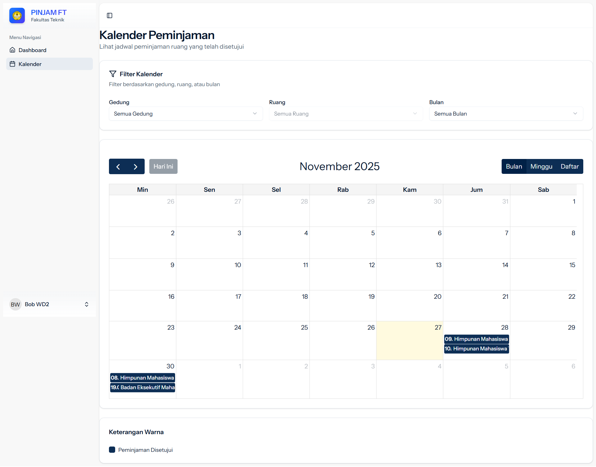
*Visualisasi jadwal penggunaan Aula*

#### Approval Page WD
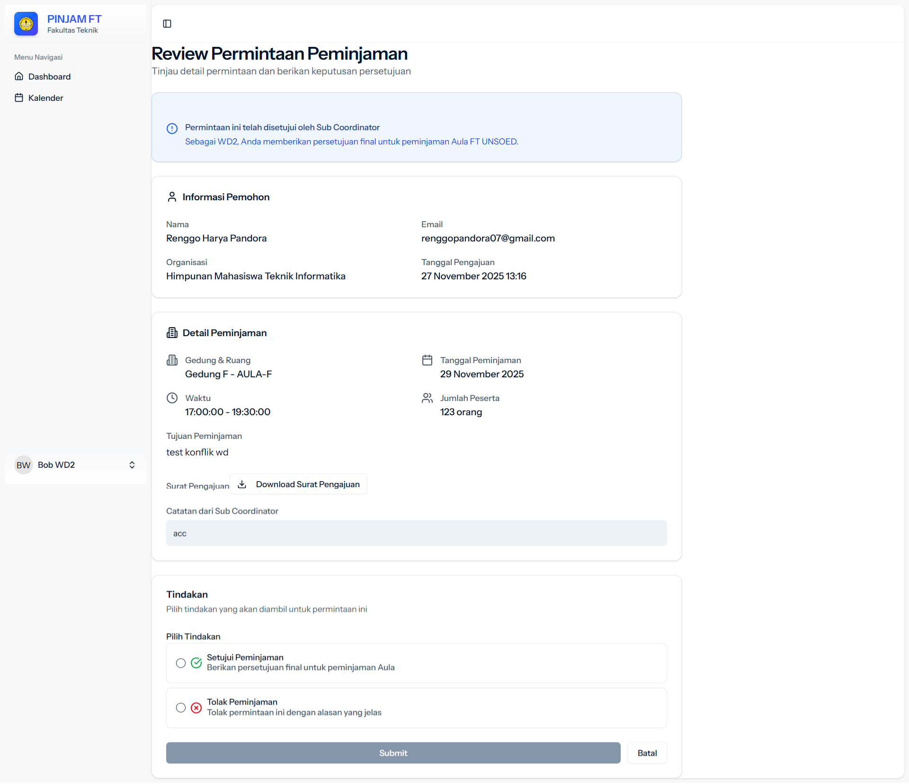
*Final approval dengan catatan dari SCO & WD*

---

## 🚀 Instalasi & Setup

### 1. Install Dependencies

```bash
# PHP Dependencies
composer install

# JavaScript Dependencies
npm install

# Install package tambahan yang diperlukan
npm install @radix-ui/react-tabs @radix-ui/react-select date-fns react-day-picker react-hook-form lucide-react

# Install Laravel Socialite untuk Google OAuth
composer require laravel/socialite
```

### 2. Environment Configuration

Salin `.env.example` ke `.env` dan konfigurasikan:

```env
APP_NAME="PINJAM FT - Fakultas Teknik"
APP_URL=http://localhost:8000

# Database
DB_CONNECTION=mysql
DB_HOST=127.0.0.1
DB_PORT=3306
DB_DATABASE=pinjamruangft
DB_USERNAME=root
DB_PASSWORD=

# Google OAuth
GOOGLE_CLIENT_ID=your-google-client-id.apps.googleusercontent.com
GOOGLE_CLIENT_SECRET=your-google-client-secret
GOOGLE_REDIRECT_URI=http://localhost:8000/auth/google/callback

# Email Configuration (Gmail SMTP)
MAIL_MAILER=smtp
MAIL_HOST=smtp.gmail.com
MAIL_PORT=587
MAIL_USERNAME=your-email@mhs.unsoed.ac.id
MAIL_PASSWORD=your-app-password-without-spaces
MAIL_ENCRYPTION=tls
MAIL_FROM_ADDRESS=your-email@mhs.unsoed.ac.id
MAIL_FROM_NAME="${APP_NAME}"

# Queue Configuration
# Gunakan 'sync' untuk development (email langsung terkirim)
# Gunakan 'database' untuk production (dengan queue worker)
QUEUE_CONNECTION=sync
```

**Catatan Email:**
- Gunakan **App Password** dari Google (bukan password akun)
- Generate di: https://myaccount.google.com/apppasswords
- Hapus semua spasi dari app password: `aolu ivbm vffy bcwb` → `aoluivbmvffybcwb`

### 3. Database Setup

```bash
# Generate application key
php artisan key:generate

# Create symbolic link for storage
php artisan storage:link

# Run migrations
php artisan migrate

# Seed database dengan data awal
php artisan db:seed
```

### 4. Build Assets

```bash
# Development
npm run dev

# Production
npm run build
```

### 5. Run Application

```bash
# Start Laravel development server
php artisan serve

# In another terminal, start Vite
npm run dev

# (Optional) Jika QUEUE_CONNECTION=database, jalankan queue worker
php artisan queue:work
# atau untuk single job:
php artisan queue:work --once
```

Aplikasi berjalan di: **http://localhost:8000**

### 6. Setup Google OAuth (Optional)

#### 1. Buat Project di Google Cloud Console

1. Kunjungi https://console.cloud.google.com/
2. Buat project baru atau pilih project yang ada
3. Aktifkan **Google+ API** atau **Google Identity**

#### 2. Konfigurasi OAuth Consent Screen

1. Pilih **"OAuth consent screen"** di menu sidebar
2. Pilih **"External"** dan klik **"Create"**
3. Isi informasi aplikasi:
   - **App name**: PINJAM FT - Fakultas Teknik
   - **User support email**: Email admin Anda
   - **Developer contact**: Email admin Anda
4. Klik **"Save and Continue"**

#### 3. Buat OAuth 2.0 Credentials

1. Pilih **"Credentials"** di menu sidebar
2. Klik **"Create Credentials"** > **"OAuth client ID"**
3. **Application type**: "Web application"
4. **Name**: PINJAM FT OAuth
5. **Authorized redirect URIs**: 
   ```
   http://localhost:8000/auth/google/callback
   ```
6. Klik **"Create"**
7. **Salin Client ID dan Client Secret** ke `.env`:
   ```env
   GOOGLE_CLIENT_ID=xxxxx.apps.googleusercontent.com
   GOOGLE_CLIENT_SECRET=xxxxx
   ```

---

## 📊 Struktur Database

Aplikasi berjalan di: **http://localhost:8000**

---

## 📊 Struktur Database

### 7 Tabel Utama

#### 1. **users**
- Menyimpan data user dan role (`applicant`, `sco`, `wd`)
- Support Google OAuth (google_id, avatar)
- Two-Factor Authentication ready

#### 2. **gedungs** (Buildings)
- 6 Gedung: A, B, C, D, E, F
- Gedung A-D: 2 lantai (4 ruangan)
- Gedung E: 3 lantai (6 ruangan)
- Gedung F: Khusus Aula

#### 3. **ruangs** (Rooms)
- **27 ruangan total**
- Format kode: `[Gedung][Lantai][Nomor]` (contoh: A101, E301, AULA-F)
- Field `is_aula` untuk identifikasi Aula

#### 4. **organisasis** (Organizations)
- BEM FT, HIMASI, HIMATIF, HIMAKOM, HIMAKEL, HIMATEKLA, dll.
- Terhubung dengan reservation requests

#### 5. **reservation_requests**
- Status flow: 
  - `pending` → `approved_sco` / `rejected_sco`
  - `pending_wd` → `approved_wd` / `rejected_wd`
- Upload surat pengajuan (storage: `storage/app/public/surat_pengajuan/`)
- Tracking: jumlah_orang, waktu, deskripsi_acara, catatan SCO/WD
- Timestamps approval: `tanggal_approval_sco`, `tanggal_approval_wd`

#### 6. **jobs**
- Queue system untuk email notifications
- Auto-processed dengan `queue:work`

#### 7. **cache**
- Application cache storage

---

## 🔄 Alur Approval

### Ruangan Biasa (Non-Aula)
```
Applicant Submit → SCO Review → Approve/Reject → Email ke Applicant
```

### Aula (Gedung F)
```
Applicant Submit → SCO Review → Forward to WD → WD Review → Approve/Reject → Email ke Applicant
```

### Diagram Flow
```
┌─────────────┐
│  Applicant  │
│   Submit    │──────────► Email ke Semua SCO
└─────────────┘
      │
      ▼
┌─────────────┐
│     SCO     │
│   Review    │
└─────────────┘
      │
      ├─── Approve (Non-Aula) ──► Email ke Applicant ✓
      │
      ├─── Reject ──────────────► Email ke Applicant ✗
      │
      └─── Forward (Aula) ──────► Email ke Semua WD
                                        │
                                        ▼
                                  ┌─────────────┐
                                  │     WD      │
                                  │   Review    │
                                  └─────────────┘
                                        │
                                        ├─── Approve ──► Email ke Applicant ✓
                                        │
                                        └─── Reject ───► Email ke Applicant ✗
```

---

## 📧 Email Notifications

Sistem mengirim email otomatis dalam 3 situasi:

### 1. Applicant Submit Pengajuan
- **Penerima**: Semua user dengan role `sco`
- **Subject**: "Pengajuan Peminjaman Ruangan Baru"
- **Isi**: Detail lengkap pengajuan (ruangan, tanggal, waktu, pemohon, organisasi, deskripsi)
- **Action Button**: Link ke dashboard SCO

### 2. SCO Forward ke WD (Khusus Aula)
- **Penerima**: Semua user dengan role `wd`
- **Subject**: "Pengajuan Peminjaman Aula untuk Persetujuan"
- **Isi**: Detail pengajuan + catatan dari SCO
- **Action Button**: Link ke dashboard WD

### 3. Perubahan Status (Approve/Reject)
- **Penerima**: Applicant yang mengajukan
- **Subject**: "Status Peminjaman Ruangan Diperbarui"
- **Isi**: Status terbaru + catatan dari SCO/WD
- **Variasi**: 5 tipe (approved_sco, forwarded_wd, rejected_sco, approved_wd, rejected_wd)

### Email Configuration

```env
# Gunakan sync untuk instant delivery (development)
QUEUE_CONNECTION=sync

# Atau gunakan database queue (production)
QUEUE_CONNECTION=database
# Jalankan: php artisan queue:work
```

---

## 🔍 Conflict Detection

Sistem mendeteksi konflik jadwal secara otomatis:

### Kriteria Konflik
- ✅ Ruangan sama
- ✅ Tanggal sama
- ✅ Waktu beririsan (overlap detection)

### Contoh Konflik
```
Request 1: AULA-F, 29 Nov 2025, 17:00-19:30 (123 peserta)
Request 2: AULA-F, 29 Nov 2025, 19:00-22:00 (130 peserta)
→ KONFLIK! Beririsan 30 menit (19:00-19:30)
```

### Visual Indicators
- 🟡 **Amber background** untuk row yang konflik
- ⚠️ **Warning icon** di kolom status
- 🔢 **Badge** menunjukkan jumlah konflik
- 🔴 **Red Review button**

### Algoritma Overlap Detection
```php
// Check if times overlap
$start1 < $end2 && $end1 > $start2
```

---

## 👥 Default Users

## 👥 Default Users

Setelah running `php artisan db:seed`:

| Role | Email | Password | Access |
|------|-------|----------|--------|
| **Applicant** | applicant@example.com | password | Form peminjaman, Riwayat |
| **SCO** | sco@example.com | password | Approval ruangan biasa, Forward Aula |
| **WD** | wd2@example.com | password | Final approval Aula |

**Catatan**: Untuk login dengan Google OAuth, gunakan email `@mhs.unsoed.ac.id`

---

## 🎨 Design System

### Color Theme
- **Primary**: Navy Blue `oklch(0.3 0.08 255)`
- **Background**: White `oklch(1 0 0)`
- **Accent**: Blue to Indigo gradient (Logo & highlights)
- **Warning**: Amber (Conflict indicators)
- **Success**: Green (Approved status)
- **Destructive**: Red (Rejected status)

### Typography
- **Font Family**: Inter (system font fallback)
- **Headings**: Semi-bold to Bold
- **Body**: Regular weight

### UI Components (shadcn/ui)
- ✅ **Tabs** - Switch view Table/Calendar
- ✅ **Table** - Data display dengan sorting & pagination
- ✅ **Calendar** - Visualisasi jadwal (react-day-picker)
- ✅ **Form** - Validation dengan react-hook-form
- ✅ **Select** - Dropdown pilihan
- ✅ **Dialog** - Modal confirmations
- ✅ **Badge** - Status indicators & conflict count
- ✅ **Button** - Primary, Secondary, Destructive variants
- ✅ **Card** - Content containers

---

## 📁 Struktur Project

```
pinjamruang_ftunsoed/
├── app/
│   ├── Http/Controllers/
│   │   ├── PeminjamanController.php      # Submit peminjaman
│   │   ├── SCO/
│   │   │   ├── BerandaController.php     # Dashboard SCO
│   │   │   └── ApprovalController.php    # Approval logic
│   │   └── WD/
│   │       ├── BerandaController.php     # Dashboard WD
│   │       └── ApprovalController.php    # Final approval
│   ├── Models/
│   │   ├── User.php
│   │   ├── Gedung.php
│   │   ├── Ruang.php
│   │   ├── Organisasi.php
│   │   └── ReservationRequest.php
│   └── Notifications/
│       ├── NewReservationRequest.php     # Email ke SCO/WD
│       └── ReservationStatusChanged.php  # Email ke Applicant
├── resources/
│   ├── js/
│   │   ├── components/
│   │   │   ├── app-sidebar.tsx           # Navigation
│   │   │   ├── app-logo.tsx              # Branding
│   │   │   └── ui/                       # shadcn components
│   │   ├── layouts/
│   │   │   └── app-layout.tsx            # Main layout
│   │   └── pages/
│   │       ├── auth/
│   │       │   ├── login.tsx
│   │       │   └── register.tsx
│   │       ├── beranda.tsx
│   │       ├── peminjaman.tsx
│   │       ├── riwayat.tsx
│   │       ├── sco/
│   │       │   ├── beranda.tsx
│   │       │   └── approval.tsx
│   │       └── wd/
│   │           ├── beranda.tsx
│   │           └── approval.tsx
│   └── views/
│       └── app.blade.php                 # Inertia root
├── database/
│   ├── migrations/                       # 7 migration files
│   └── seeders/                          # Data awal
├── storage/
│   └── app/
│       └── public/
│           └── surat_pengajuan/          # Uploaded documents
└── public/
    ├── assets/
    │   └── images/                       # Screenshots
    └── storage -> ../storage/app/public  # Symbolic link
```

---

## 🔐 Security Features

- ✅ **CSRF Protection** - Laravel default
- ✅ **SQL Injection Prevention** - Eloquent ORM
- ✅ **XSS Protection** - React auto-escaping
- ✅ **File Upload Validation** - Mime type & size check (PDF/Word, max 5MB)
- ✅ **Route Authorization** - Middleware per role
- ✅ **Google OAuth 2.0** - Secure third-party authentication
- ✅ **Two-Factor Ready** - Laravel Fortify support

---

## 🚀 Deployment (Production)

### 1. Server Requirements
- PHP 8.2+
- MySQL 5.7+ / MariaDB 10.3+
- Composer
- Node.js 18+
- Nginx / Apache

### 2. Production Setup

```bash
# Clone & install dependencies
git clone <repository-url>
composer install --optimize-autoloader --no-dev
npm install && npm run build

# Environment
cp .env.example .env
# Edit .env untuk production values
php artisan key:generate

# Database
php artisan migrate --force
php artisan db:seed --force

# Storage & cache
php artisan storage:link
php artisan config:cache
php artisan route:cache
php artisan view:cache
```

### 3. Queue Worker (Systemd)

Buat file `/etc/systemd/system/laravel-queue.service`:

```ini
[Unit]
Description=Laravel Queue Worker
After=network.target

[Service]
Type=simple
User=www-data
WorkingDirectory=/path/to/project
ExecStart=/usr/bin/php artisan queue:work --sleep=3 --tries=3
Restart=always

[Install]
WantedBy=multi-user.target
```

```bash
sudo systemctl enable laravel-queue
sudo systemctl start laravel-queue
```

### 4. Nginx Configuration

```nginx
server {
    listen 80;
    server_name your-domain.com;
    root /path/to/project/public;

    add_header X-Frame-Options "SAMEORIGIN";
    add_header X-Content-Type-Options "nosniff";

    index index.php;

    charset utf-8;

    location / {
        try_files $uri $uri/ /index.php?$query_string;
    }

    location ~ \.php$ {
        fastcgi_pass unix:/var/run/php/php8.2-fpm.sock;
        fastcgi_param SCRIPT_FILENAME $realpath_root$fastcgi_script_name;
        include fastcgi_params;
    }

    location ~ /\.(?!well-known).* {
        deny all;
    }
}
```

---

## 🛠 Development Tips

### Add New Navigation Item
Edit `resources/js/components/app-sidebar.tsx`:
```tsx
const mainNavItems: NavItem[] = [
    {
        title: 'Menu Name',
        href: '/route-path',
        icon: IconComponent,
    },
];
```

### Add New Route
Edit `routes/web.php`:
```php
Route::middleware(['auth'])->group(function () {
    Route::get('path', [Controller::class, 'method'])->name('route.name');
});
```

### Create New Page
Create file in `resources/js/pages/[name].tsx`:
```tsx
import AppLayout from '@/layouts/app-layout';
import { Head } from '@inertiajs/react';

export default function PageName() {
    return (
        <>
            <Head title="Page Title" />
            <AppLayout>
                {/* Your content */}
            </AppLayout>
        </>
    );
}
```

### Add New Notification
1. Create notification class:
```bash
php artisan make:notification NotificationName
```

2. Implement `toMail()` method
3. Send notification:
```php
$user->notify(new NotificationName($data));
```

---

## 🐛 Troubleshooting

### Email tidak terkirim
- **Cek QUEUE_CONNECTION**: Pastikan `sync` atau jalankan `queue:work`
- **App Password**: Hapus spasi dari app password di `.env`
- **Check logs**: `storage/logs/laravel.log`

### Google OAuth error
- **Authorized redirect URIs**: Pastikan match dengan `GOOGLE_REDIRECT_URI`
- **Credentials**: Periksa Client ID & Secret di `.env`

### Asset tidak muncul
```bash
php artisan storage:link
npm run build
```

### Cache issues
```bash
php artisan optimize:clear
```

---

## 📝 API Routes

### Authentication
```
GET  /login                    - Login page
POST /login                    - Process login
GET  /register                 - Register page  
POST /register                 - Process registration
POST /logout                   - Logout
GET  /auth/google              - Google OAuth redirect
GET  /auth/google/callback     - Google OAuth callback
```

### Applicant Routes
```
GET  /beranda                  - Dashboard
GET  /peminjaman               - Form peminjaman
POST /peminjaman               - Submit peminjaman
GET  /riwayat                  - History peminjaman
GET  /kalender                 - Calendar view
```

### SCO Routes
```
GET  /sco/beranda              - SCO Dashboard
GET  /sco/approval/{id}        - Review request
POST /sco/approval/{id}        - Process (approve/forward/reject)
GET  /sco/kalender             - Calendar view
```

### WD Routes
```
GET  /wd/beranda               - WD Dashboard
GET  /wd/approval/{id}         - Review request
POST /wd/approval/{id}         - Final approval (approve/reject)
GET  /wd/kalender              - Calendar view
```

---

## 📄 License

This project is developed for **Fakultas Teknik Universitas Jenderal Soedirman** internal use.

---

## 👨‍💻 Developer


**Tech Stack**: Laravel 12 • React 18 • TypeScript • Inertia.js • TailwindCSS

---


<p align="center">
  <strong>PINJAM FT - Fakultas Teknik UNSOED</strong><br>
  Sistem Peminjaman Ruangan Modern dengan Email Notification & Conflict Detection
</p>
